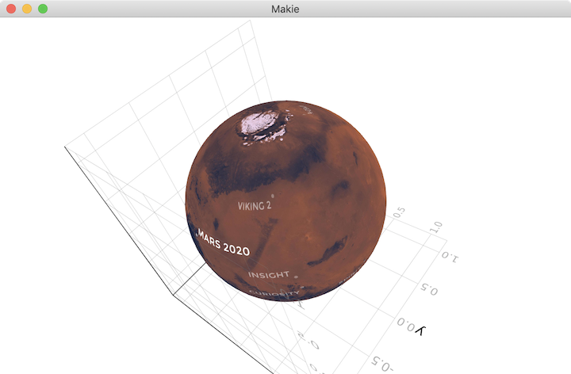
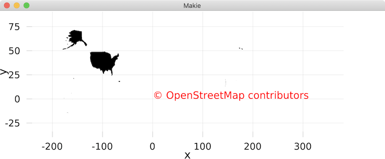

# Maps.jl

Beginnings of a package to display **maps** of all kinds, in various projections and with various configuragtions.

This package uses [Makie.jl](https://github.com/JuliaPlots/Makie.jl) to plot maps and globes from source data.

This has only just started, but the idea would be to support many features such as _projections, scale, arbitrary resolutions, GPS data, points of interest, etc_.

## Inspiration

Inspired by R's [`maps`](https://www.rdocumentation.org/packages/maps) package, by [Alex Deckmyn](https://www.rdocumentation.org/collaborators/name/Alex%20Deckmyn).

